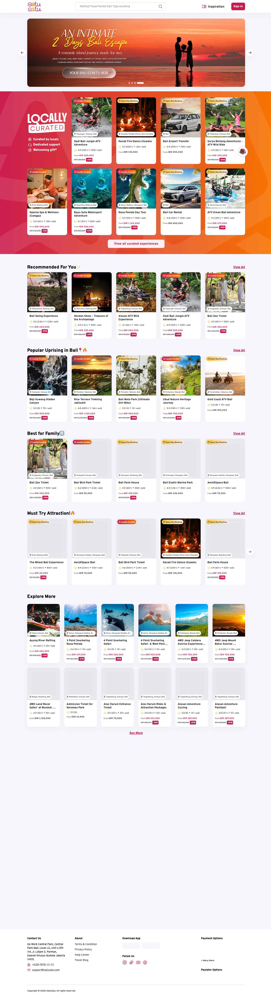
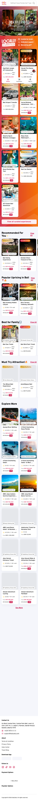
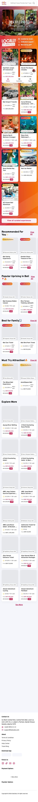
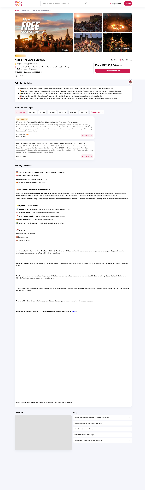

# SatuSatu Lighthouse Audit Report

> **Generated:** 2026-03-31
> **Techstack:** Next.js 16 (App Router) + Tencent EdgeOne CDN
> **Benchmarks last updated:** 2026-03-31

---

## Lighthouse Settings

| Setting | Value |
|---------|-------|
| Lighthouse version | 12.8.2 |
| Categories | performance, accessibility, best-practices, seo |
| User agent | Mozilla/5.0 (Macintosh; Intel Mac OS X 10_15_7) AppleWebKit/537.36 (KHTML, like Gecko) HeadlessChrome/146.0.0.0 Safari/537.36 |

| Setting | Desktop | Mobile Unthrottled | Mobile Throttled |
|---------|---------|-------------------|------------------|
| Network throttling | None | None | Slow 4G (1.6 Mbps / 750 Kbps, 150ms RTT) |
| CPU slowdown | None | None | 4× |
| Viewport | 1440 × 900 | 375 × 812 | 375 × 812 |

---

## Screenshots

### Homepage

| Desktop | Mobile Unthrottled | Mobile Throttled |
|---------|-------------------|------------------|
|  |  |  |

### Catalog Detail

| Desktop | Mobile Unthrottled | Mobile Throttled |
|---------|-------------------|------------------|
|  |  |  |

---

## Industry Benchmark Context

> Benchmarks last researched: 2026-03-31
> Run `/lighthouse-audit-satusatu refresh-benchmarks` to update.

| Metric | Google "Good" | Travel/Ticketing Industry Median | Audit Target | Sources |
|--------|---------------|----------------------------------|--------------|---------|
| Performance (mobile) | ≥ 50 (acceptable) | ~35 | **≥ 50** | [web.dev](https://web.dev/articles/vitals), [HTTP Archive 2025](https://almanac.httparchive.org/en/2025/performance) |
| Performance (desktop) | ≥ 50 (acceptable) | ~72 | **≥ 72** | [HTTP Archive 2025](https://almanac.httparchive.org/en/2025/performance), [DebugBear](https://www.debugbear.com/docs/metrics/lighthouse-performance) |
| Accessibility | ≥ 90 | ~84 | **≥ 85** | [HTTP Archive 2025](https://almanac.httparchive.org/en/2025/accessibility) |
| Best Practices | ≥ 80 | ~75 | **≥ 80** | [Practical Ecommerce](https://www.practicalecommerce.com/70-leading-retailers-lighthouse-scores-revealed) |
| SEO | ≥ 90 | ~86 | **≥ 90** | [Practical Ecommerce](https://www.practicalecommerce.com/70-leading-retailers-lighthouse-scores-revealed) |
| LCP | ≤ 2.5s | ~3.0–4.0s | **≤ 2.5s** | [web.dev CWV](https://web.dev/articles/vitals) |

---

## Executive Summary

### Homepage

| Category | Desktop | Mobile Unthrottled | Mobile Throttled |
|----------|---------|-------------------|------------------|
| Performance | ❌ 36 | ✅ 99 | ⚠️ 48 |
| Accessibility | ✅ 90 | ✅ 90 | ✅ 90 |
| Best Practices | ⚠️ 74 | ⚠️ 75 | ⚠️ 75 |
| SEO | ⚠️ 83 | ⚠️ 83 | ⚠️ 83 |
| LCP | ❌ 7.7s | ✅ 1.3s | ❌ 8.2s |

### Catalog Detail

| Category | Desktop | Mobile Unthrottled | Mobile Throttled |
|----------|---------|-------------------|------------------|
| Performance | ❌ 41 | ✅ 96 | ✅ 55 |
| Accessibility | ✅ 95 | ⚠️ 83 | ⚠️ 83 |
| Best Practices | ❌ 56 | ❌ 57 | ❌ 57 |
| SEO | ✅ 92 | ✅ 92 | ✅ 92 |
| LCP | ❌ 8.3s | ✅ 1.3s | ❌ 7.9s |

**Legend:** ✅ Pass (meets audit target) · ⚠️ Needs Work · ❌ Fail (below target)

**Key Insight:** Mobile unthrottled scores **96–99 performance** with 1.3s LCP — the code and rendering pipeline are fast. All performance degradation comes from network throttling and CPU slowdown. This is a **Network bottleneck**, not a code bottleneck.

---

## Score Dashboard

| Category | URL | Mode | Score | Google "Good" | Industry Median | Target | Status |
|----------|-----|------|-------|---------------|-----------------|--------|--------|
| Performance | Homepage | Desktop | **36** | ≥ 50 | ~72 | ≥ 72 | ❌ P0 |
| Performance | Homepage | Mobile Unthrottled | **99** | ≥ 50 | ~35 | ≥ 50 | ✅ Pass |
| Performance | Homepage | Mobile Throttled | **48** | ≥ 50 | ~35 | ≥ 50 | ⚠️ P1 |
| Performance | Catalog | Desktop | **41** | ≥ 50 | ~72 | ≥ 72 | ❌ P0 |
| Performance | Catalog | Mobile Unthrottled | **96** | ≥ 50 | ~35 | ≥ 50 | ✅ Pass |
| Performance | Catalog | Mobile Throttled | **55** | ≥ 50 | ~35 | ≥ 50 | ✅ Pass |
| Accessibility | Homepage | Desktop | **90** | ≥ 90 | ~84 | ≥ 85 | ✅ Pass |
| Accessibility | Homepage | Mobile Unthrottled | **90** | ≥ 90 | ~84 | ≥ 85 | ✅ Pass |
| Accessibility | Homepage | Mobile Throttled | **90** | ≥ 90 | ~84 | ≥ 85 | ✅ Pass |
| Accessibility | Catalog | Desktop | **95** | ≥ 90 | ~84 | ≥ 85 | ✅ Pass |
| Accessibility | Catalog | Mobile Unthrottled | **83** | ≥ 90 | ~84 | ≥ 85 | ⚠️ P2 |
| Accessibility | Catalog | Mobile Throttled | **83** | ≥ 90 | ~84 | ≥ 85 | ⚠️ P2 |
| Best Practices | Homepage | Desktop | **74** | ≥ 80 | ~75 | ≥ 80 | ⚠️ P2 |
| Best Practices | Homepage | Mobile Unthrottled | **75** | ≥ 80 | ~75 | ≥ 80 | ⚠️ P2 |
| Best Practices | Homepage | Mobile Throttled | **75** | ≥ 80 | ~75 | ≥ 80 | ⚠️ P2 |
| Best Practices | Catalog | Desktop | **56** | ≥ 80 | ~75 | ≥ 80 | ❌ P0 |
| Best Practices | Catalog | Mobile Unthrottled | **57** | ≥ 80 | ~75 | ≥ 80 | ❌ P0 |
| Best Practices | Catalog | Mobile Throttled | **57** | ≥ 80 | ~75 | ≥ 80 | ❌ P0 |
| SEO | Homepage | Desktop | **83** | ≥ 90 | ~86 | ≥ 90 | ⚠️ P2 |
| SEO | Homepage | Mobile Unthrottled | **83** | ≥ 90 | ~86 | ≥ 90 | ⚠️ P2 |
| SEO | Homepage | Mobile Throttled | **83** | ≥ 90 | ~86 | ≥ 90 | ⚠️ P2 |
| SEO | Catalog | Desktop | **92** | ≥ 90 | ~86 | ≥ 90 | ✅ Pass |
| SEO | Catalog | Mobile Unthrottled | **92** | ≥ 90 | ~86 | ≥ 90 | ✅ Pass |
| SEO | Catalog | Mobile Throttled | **92** | ≥ 90 | ~86 | ≥ 90 | ✅ Pass |
| LCP | Homepage | Desktop | **7.7s** | ≤ 2.5s | ~3.5s | ≤ 2.5s | ❌ P0 |
| LCP | Homepage | Mobile Unthrottled | **1.3s** | ≤ 2.5s | ~3.5s | ≤ 2.5s | ✅ Pass |
| LCP | Homepage | Mobile Throttled | **8.2s** | ≤ 2.5s | ~3.5s | ≤ 2.5s | ❌ P0 |
| LCP | Catalog | Desktop | **8.3s** | ≤ 2.5s | ~3.5s | ≤ 2.5s | ❌ P0 |
| LCP | Catalog | Mobile Unthrottled | **1.3s** | ≤ 2.5s | ~3.5s | ≤ 2.5s | ✅ Pass |
| LCP | Catalog | Mobile Throttled | **7.9s** | ≤ 2.5s | ~3.5s | ≤ 2.5s | ❌ P0 |

### Additional Metrics

| Metric | HP Desktop | HP Mob-Unthrottled | HP Mob-Throttled | Cat Desktop | Cat Mob-Unthrottled | Cat Mob-Throttled |
|--------|-----------|-------------------|-----------------|-------------|--------------------|--------------------|
| FCP | 2.2s | 0.3s | 3.1s | 2.3s | 0.4s | 3.3s |
| LCP | 7.7s | 1.3s | 8.2s | 8.3s | 1.3s | 7.9s |
| TBT | 510ms | 0ms | 500ms | 370ms | 10ms | 290ms |
| Speed Index | 7.8s | 3.5s | 11.5s | 12.5s | 5.0s | 9.4s |
| TTI | 19.4s | 1.3s | 18.2s | 20.5s | 1.3s | 20.7s |
| CLS | 0 | 0 | 0 | 0 | 0.004 | 0.004 |

---

## Throttle Impact Analysis

Compares mobile-unthrottled vs mobile-throttled to isolate network/CPU impact from code issues.

### Homepage

| Metric | Unthrottled | Throttled | Delta | Bottleneck |
|--------|-------------|-----------|-------|------------|
| Performance | 99 | 48 | **-51** | Network |
| LCP | 1.3s | 8.2s | **+6.9s** | Network |
| TBT | 0ms | 500ms | **+500ms** | Network |
| FCP | 0.3s | 3.1s | **+2.8s** | Network |
| Speed Index | 3.5s | 11.5s | **+8.0s** | Network |
| TTI | 1.3s | 18.2s | **+16.9s** | Network |

### Catalog Detail

| Metric | Unthrottled | Throttled | Delta | Bottleneck |
|--------|-------------|-----------|-------|------------|
| Performance | 96 | 55 | **-41** | Network |
| LCP | 1.3s | 7.9s | **+6.6s** | Network |
| TBT | 10ms | 290ms | **+280ms** | Network |
| FCP | 0.4s | 3.3s | **+2.9s** | Network |
| Speed Index | 5.0s | 9.4s | **+4.4s** | Network |
| TTI | 1.3s | 20.7s | **+19.4s** | Network |

**Bottleneck Classification:**
- **Code** — Unthrottled score is also poor (below audit target). Problem is in the code.
- **Network** — Unthrottled passes but throttled fails. Code is fine but payloads degrade under constrained networks.
- **Both** — Unthrottled is borderline and throttling pushes it to failure.

### Key Finding

**All performance bottlenecks are Network-type.** Mobile unthrottled scores 96–99 with LCP of 1.3s, proving the rendering pipeline and code are fast. When Slow 4G throttling is applied, performance drops to 48–55 and LCP balloons to 7.9–8.2s. This means optimization efforts should focus on:

1. **Reducing transfer sizes** (smaller images, compressed assets, tree-shaken JS)
2. **Aggressive CDN caching** (EdgeOne edge caching for static resources)
3. **Preloading critical resources** (so they arrive early even on slow connections)
4. **Minimizing round-trips** (inline critical CSS, reduce request chains)

The desktop scores (36–41) are surprisingly poor despite no throttling, which suggests the desktop Lighthouse audit is also being bottlenecked by server response times (TTFB) and large transfer sizes that take time even on fast connections.

---

## Findings by Severity

### P0 — Critical

Below Google's "good" threshold AND below industry median.

---

#### P0-1: LCP — Desktop + Mobile Throttled (All Pages)

**Throttle Impact:** Unthrottled LCP = 1.3s ✅ → Throttled LCP = 7.9–8.2s ❌ → **Network bottleneck**

| Page | Mode | Current | Google "Good" | Industry Median | Target | Status |
|------|------|---------|---------------|-----------------|--------|--------|
| Homepage | Desktop | **7.7s** | ≤ 2.5s | ~3.5s | ≤ 2.5s | ❌ P0 |
| Homepage | Mobile Throttled | **8.2s** | ≤ 2.5s | ~3.5s | ≤ 2.5s | ❌ P0 |
| Catalog | Desktop | **8.3s** | ≤ 2.5s | ~3.5s | ≤ 2.5s | ❌ P0 |
| Catalog | Mobile Throttled | **7.9s** | ≤ 2.5s | ~3.5s | ≤ 2.5s | ❌ P0 |

**Suggested Fix (Next.js 16 + EdgeOne):**

1. **Optimize LCP image delivery via EdgeOne:**
   - Enable EdgeOne image optimization (WebP/AVIF auto-conversion at edge) — https://www.tencentcloud.com/document/product/228/47823
   - Set `Cache-Control: public, s-maxage=31536000, immutable` for hashed static assets
   - Enable EdgeOne smart compression for HTML/CSS/JS

2. **Preload the LCP element** so it starts downloading before the browser discovers it:
   ```tsx
   // In layout.tsx or page.tsx metadata
   export const metadata = {
     other: { link: [{ rel: 'preload', href: '/hero.webp', as: 'image', type: 'image/webp' }] }
   };
   ```

3. **Reduce TTFB with EdgeOne HTML caching:**
   - Cache HTML pages at edge with short TTLs: `s-maxage=60, stale-while-revalidate=3600`
   - This cuts the initial server response from origin → edge, reducing the cascade

4. **Minimize request chains** — Inline critical CSS via Next.js built-in optimization, eliminating render-blocking CSS round-trips on slow connections

**Effort:** Large

---

#### P0-2: Desktop Performance — Both Pages

**Throttle Impact:** Desktop has no throttling, yet scores 36–41. Given that unthrottled mobile scores 96–99, the desktop Lighthouse test is bottlenecked by large payloads and server response times.

| Page | Current | Google "Good" | Industry Median | Target | Status |
|------|---------|---------------|-----------------|--------|--------|
| Homepage | **36** | ≥ 50 | ~72 | ≥ 72 | ❌ P0 |
| Catalog | **41** | ≥ 50 | ~72 | ≥ 72 | ❌ P0 |

**Root Cause:** Desktop Lighthouse sends real network requests (no throttle but also no localhost cache). The 7.7–8.3s LCP and 19–20s TTI indicate heavy payload sizes and long server response times.

**Suggested Fix (Next.js 16 + EdgeOne):**

1. **Enable EdgeOne edge caching for all static assets** — images, fonts, JS chunks, CSS
2. **Code-split heavy bundles** using Next.js `dynamic()` for non-critical desktop components (recommendation carousels, explore sections, chat widgets):
   ```jsx
   const RecommendationCarousel = dynamic(() => import('./RecommendationCarousel'), { ssr: false });
   ```
3. **Defer third-party scripts** via `next/script` with `strategy="lazyOnload"` for analytics, tracking pixels, chat widgets
4. **Enable Next.js 16 Streaming SSR** with `<Suspense>` boundaries — send the critical above-the-fold content first, stream below-the-fold sections

**Effort:** Large

---

#### P0-3: Best Practices — Catalog Detail (56–57, All Modes)

**Throttle Impact:** Score is 56–57 across all 3 modes — **this is a Code issue**, not network-related.

| Mode | Current | Google "Good" | Industry Median | Target | Status |
|------|---------|---------------|-----------------|--------|--------|
| Desktop | **56** | ≥ 80 | ~75 | ≥ 80 | ❌ P0 |
| Mobile Unthrottled | **57** | ≥ 80 | ~75 | ≥ 80 | ❌ P0 |
| Mobile Throttled | **57** | ≥ 80 | ~75 | ≥ 80 | ❌ P0 |

**Suggested Fix (Next.js 16 + EdgeOne):**

1. **Fix console errors** — Playwright captured 1–2 console errors on catalog page. Audit and resolve
2. **Serve images via EdgeOne image optimization** instead of raw URLs — auto WebP/AVIF conversion
3. **Add security headers** via EdgeOne edge rules or Next.js `headers()`:
   ```js
   async headers() {
     return [{ source: '/(.*)', headers: [
       { key: 'X-Content-Type-Options', value: 'nosniff' },
       { key: 'X-Frame-Options', value: 'DENY' },
       { key: 'Referrer-Policy', value: 'strict-origin-when-cross-origin' },
       { key: 'Content-Security-Policy', value: "default-src 'self'; ..." },
     ]}];
   }
   ```
4. **Fix deprecated API usage** — check for deprecated browser APIs and update
5. **Ensure all images have explicit dimensions** to prevent layout shifts and best-practices warnings

**Effort:** Medium

---

### P1 — High

Below Google's "good" threshold but near industry median.

---

#### P1-1: Homepage Mobile Performance — Throttled (48)

**Throttle Impact:** Unthrottled = 99 → Throttled = 48 → **Network bottleneck**

| Mode | Current | Google "Good" | Industry Median | Target | Status |
|------|---------|---------------|-----------------|--------|--------|
| Mobile Throttled | **48** | ≥ 50 | ~35 | ≥ 50 | ⚠️ P1 |

Just 2 points below the target. Above the industry median (35) but below Google's acceptable (50).

**Suggested Fix (Next.js 16 + EdgeOne):**
- Same network optimization as P0-1 (EdgeOne caching, image optimization, preload LCP)
- This will likely push the throttled score above 50 once transfer sizes are reduced

**Effort:** Addressed by P0-1 fixes

---

### P2 — Medium

Meets Google's minimum but below industry median or audit target.

---

#### P2-1: Accessibility — Catalog Detail Mobile (83)

Score is consistent across throttled/unthrottled (83 both) — **Code issue**.

| Mode | Current | Google "Good" | Industry Median | Target | Status |
|------|---------|---------------|-----------------|--------|--------|
| Mobile Unthrottled | **83** | ≥ 90 | ~84 | ≥ 85 | ⚠️ P2 |
| Mobile Throttled | **83** | ≥ 90 | ~84 | ≥ 85 | ⚠️ P2 |

**Suggested Fix (Next.js 16):**
1. Ensure all interactive elements have minimum 48×48px touch targets
2. Fix color contrast issues on mobile viewport
3. Add ARIA labels to booking buttons, date pickers, package selection tabs
4. Ensure all activity/gallery images have meaningful `alt` attributes

**Effort:** Quick Win

---

#### P2-2: Best Practices — Homepage (74–75, All Modes)

Consistent across all modes — **Code issue**.

| Mode | Current | Google "Good" | Industry Median | Target | Status |
|------|---------|---------------|-----------------|--------|--------|
| Desktop | **74** | ≥ 80 | ~75 | ≥ 80 | ⚠️ P2 |
| Mobile Unthrottled | **75** | ≥ 80 | ~75 | ≥ 80 | ⚠️ P2 |
| Mobile Throttled | **75** | ≥ 80 | ~75 | ≥ 80 | ⚠️ P2 |

**Suggested Fix (Next.js 16 + EdgeOne):**
1. Fix console warnings (Playwright captured 2–5 warnings on homepage)
2. Add security headers via EdgeOne or Next.js (same as P0-3)
3. Ensure all images use EdgeOne image optimization pipeline

**Effort:** Quick Win

---

#### P2-3: SEO — Homepage (83, All Modes)

Consistent across all modes — **Code issue**.

| Mode | Current | Google "Good" | Industry Median | Target | Status |
|------|---------|---------------|-----------------|--------|--------|
| All modes | **83** | ≥ 90 | ~86 | ≥ 90 | ⚠️ P2 |

**Suggested Fix (Next.js 16):**
1. Add structured data (JSON-LD) for `TravelAgency`, `TouristAttraction`, `Product` schemas via Next.js `metadata`
2. Ensure homepage meta description is 150–160 characters
3. Add canonical URL via `metadata.alternates.canonical`
4. Fix heading hierarchy — single `<h1>`, proper `<h2>`/`<h3>` nesting
5. Ensure all images have descriptive `alt` text

**Effort:** Quick Win

---

### P3 — Low

Meets thresholds. Minor optimization opportunities.

---

#### P3-1: CLS — Excellent Across All Pages and Modes

CLS is 0–0.004 everywhere. No action needed. This is a strong point.

#### P3-2: Catalog Mobile Performance — Throttled (55)

Passes the mobile target (≥ 50) but could improve. Will benefit from P0-1 network optimizations.

---

## Competitor Context

Based on 2025 research across travel/ticketing platforms (Klook, GetYourGuide, Viator, Tiqets):

| Benchmark | SatuSatu (Throttled Mobile avg) | SatuSatu (Unthrottled Mobile avg) | Travel Industry Median | Position |
|-----------|--------------------------------|-----------------------------------|------------------------|----------|
| Mobile Performance | 51.5 | **97.5** | ~35 | Above median (throttled), excellent (unthrottled) |
| Desktop Performance | 38.5 | — | ~72 | **Well below median** |
| Accessibility | 86.5 | 86.5 | ~84 | Above median |
| SEO | 87.5 | 87.5 | ~86 | At median |
| Best Practices | 66 | 66 | ~75 | **Below median** |
| Mobile LCP | 8.1s | **1.3s** | ~3.5s | Code is fast; network delivery is the bottleneck |

**Key Takeaway:** SatuSatu's codebase is performant — mobile unthrottled proves this with 96–99 performance scores. The bottleneck is entirely in network delivery: large transfer sizes, slow server response times, and unoptimized asset delivery through the CDN. Investing in EdgeOne CDN optimization (image conversion, edge caching, compression) will yield the highest ROI.

---

## Priority Action Plan

| Priority | Finding | Bottleneck | Effort | Expected Impact |
|----------|---------|------------|--------|-----------------|
| **P0** | LCP 7.7–8.3s on desktop & throttled mobile | Network | Large | LCP from 8s → ≤2.5s via EdgeOne caching + image optimization + preload |
| **P0** | Desktop performance 36–41 | Network | Large | Performance from 36–41 → ≥72 via EdgeOne edge caching + code-splitting + streaming SSR |
| **P0** | Catalog Best Practices 56–57 | Code | Medium | Best Practices from 57 → ≥80 via security headers + console fixes + image optimization |
| **P1** | Homepage mobile throttled performance 48 | Network | _(addressed by P0)_ | Performance from 48 → ≥50, likely ≥70 with P0 fixes |
| **P2** | Catalog mobile accessibility 83 | Code | Quick Win | Accessibility from 83 → ≥85 via touch targets + ARIA |
| **P2** | Homepage Best Practices 74–75 | Code | Quick Win | Best Practices from 75 → ≥80 via console fixes + security headers |
| **P2** | Homepage SEO 83 | Code | Quick Win | SEO from 83 → ≥90 via structured data + meta + canonical |

---

## Techstack Context

- **Framework:** Next.js 16 (App Router)
  - `tencent edgeone` for image optimization — https://www.tencentcloud.com/document/product/228/47823
  - `metadata` API for head management
- **CDN / Edge:** Tencent EdgeOne
  - Edge caching with `s-maxage` / `Cache-Control`
  - Edge functions for dynamic routing
  - Global PoP distribution
- **Deployment:** Production environment
